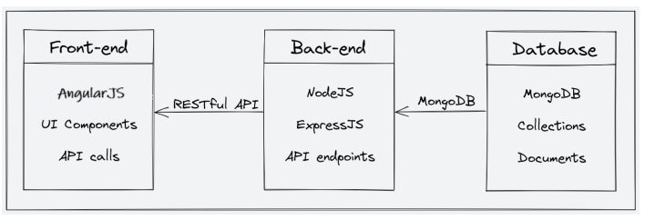

# ChessImprover: Play and Learn Chess (MEAN App) [Website Link](https://chess-improver.vercel.app/)

## Project Description

ChessImprover is a fully functional chess-education platform that enables users to Play With A Coach/Friend (available feature) or Play With A Computer with real-time-every-move-AI-explanation (Intended Feature) in MEAN stack, which includes
Angular, NodeJS, MongoDB, and ExpressJS.
ChessImprover aims to provide:
* A platforn on which a player can play and chat with their peers and instructors across the globe.
* A platform on which a player can learn on their own leveraging latest AI capabilities.

In the following sections, we will cover the technical details of the platform, including:
1. System architecture: The high-level overview of the platform's components and
diagrams of the architecture.
2. Front-end: The description of the front-end architecture, user interface design,
features, and functionalities of the front-end, and frameworks, libraries, and tools
used.
3. Back-end: The description of the back-end architecture, features and functionalities of
the back-end, frameworks, libraries, tools used, and data models and database schema.

In summary, ChessImprover is a versatile and intuitive chess-education platform that is designed to
provide an immersive learning experience to students and a platform for instructors to
showcase their expertise. In the following sections, we will delve into the technical details
of the platform, which will provide a comprehensive understanding of the platform's
features and functionalities.

## System Architecture

The ChessImprover platform consists of three main components: the front end, the
back end, and the database. The platform follows a client-server architecture, with the
front end serving as the client and the back end and database serving as the server.

### Front-end 

The front end of the platform is built using Angular which is a complete toolkit to create seamless
interfaces, which are critical for providing an engaging learning experience to the students.
The front end communicates with the back end using RESTful API calls

### Back-end 

The back end of the platform is built using NodeJS and ExpressJS,. The back end
provides APIs for the front end to consume, which include functionalities such as user
authentication, course creation, and course consumption. The back end also handles the
logic for processing and storing the course content and user data.

### Database

The database for the platform is built using MongoDB, which is a NoSQL database that
provides a flexible and scalable data storage solution. MongoDB allows for the storage of
unstructured and semi-structured data. The database stores the course content, user data, and other
relevant information related to the platform.

### Architecture Diagram

Here is a high-level diagram that illustrates the architecture of the ChessImprover ed-tech
platform:

## Front End

The front end of ChessImprover has the following pages:

* Homepage: This page asks whether player wants to play with a Friend or a Computer.
* Game Screen: This page contains the chess board (and the intended chat-bot)

## Back End

Description of the Back-end Architecture: 
ChessImprover uses a monolithic architecture, with the backend built using Node.js and
Express.js, and MongoDB as the primary database. 

Features and Functionalities of the Back-end: 
The back end of ChessImprover provides a range of features and functionalities, including:
1. AIExplanation: ChatGPT response are generated here.
2. Authentication: If player wants to chat with a friend they will first have to log in.
3. Chat: WebSocket and chat functionality is defined here.

Frameworks, Libraries, and Tools used: 
The back end of ChessImprover uses a range of frameworks, libraries, and tools to ensure its
functionality and performance, including:
1. Node.js: Node.js is used as the primary framework for the back end.
2. MongoDB: MongoDB is used as the primary database, providing a flexible and scalable
data storage solution.
3. Express.js: Express.js is used as a web application framework, providing a range of
features and tools for building web applications.
4. JWT: JWT (JSON Web Tokens) are used for authentication and authorization,
providing a secure and reliable way to manage user credentials.
5. Bcrypt: Bcrypt is used for password hashing, adding an extra layer of security to user
data.
6. Mongoose: Mongoose is used as an Object Data Modeling (ODM) library, providing a
way to interact with MongoDB using JavaScript

### Data Models and Database Schema: 
The back end of ChessImprover uses a range of data models and database schemas to
manage data, including:
1. User: Includes fields such as name, email, password, and course details
for each player.
2. Games: Media-Server Links to the PGN of games played by the user. 

Overall, the back-end of ChessImprover is designed to provide a robust and scalable solution
for an education platform, with a focus on security, reliability, and ease of use. By using the
right frameworks, libraries, and tools, we can ensure that the platform functions smoothly
and provides an optimal user experience for all its users.